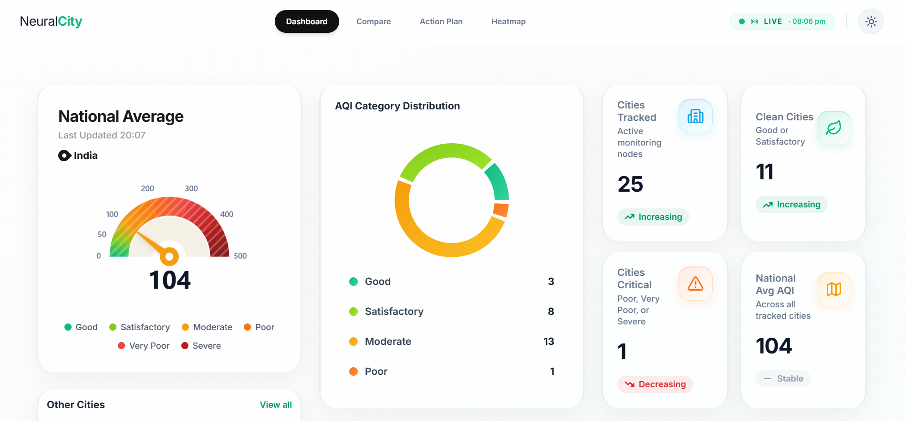

# Neural City — Air Health Module

[](https://nextjs.org/)
[](https://reactjs.org/)
[](https://tailwindcss.com/)
[](https://www.framer.com/motion/)

Welcome to the **Neural City Air Health Module**! This is a state-of-the-art, high-performance web dashboard designed to track, visualize, and analyze Air Quality Index (AQI) data across major cities in India. 

The dashboard provides actionable intelligence for citizens and government officers using real-time data sourced from the **CPCB (Central Pollution Control Board)**.

**Live Demo:** [https://NeuralCity-AQI.vercel.app](https://NeuralCity-AQI.vercel.app)

---

## Dashboard Overview



*(A sleek, modern interface featuring frosted glassmorphism and an elegant deep-black dark mode).*

---

## Key Features

### 1. Real-Time AQI Monitoring
Track the National Average AQI instantly on the homepage with an animated, responsive gauge. View the top most polluted and cleanest cities at a glance.

### 2. Interactive India Heatmap
Navigate a fully interactive, SVG-based topographical map of India. Cities pulse with severity-coded colors (Good to Severe). Hover over nodes for instant readings, or click to dive into city-specific diagnostics.

### 3. Deep City Diagnostics
Every city has a dedicated intelligence page featuring:
- **Pollutant Breakdown:** Radar charts isolating PM2.5, PM10, NO₂, SO₂, and more.
- **Peer Comparison:** Automatically benchmarks a city against similar-sized metropolitan peers.
- **Seasonal Trends:** Historical area charts mapping AQI patterns across different months.

### 4. Comparison Engine
Select any two cities to generate a side-by-side analysis. The engine automatically calculates the AQI differential, identifies the primary driving pollutant, and generates a plain-english verdict (e.g., *"Mumbai's air is 42% cleaner than Delhi's, primarily due to lower PM2.5 levels"*).

### 5. Government & Policy Tools
A specialized suite designed for city planners and officials:
- **Intervention Priority Matrix:** Recommends specific policy changes based on the dominant local pollutants.
- **Budget Justifier:** Calculates estimated healthcare cost savings if air quality targets are met.
- **Alert Calendar:** Visualizes critical smog alerts and historical hazard days.

---

## Technology Stack

This project is built for absolute maximum performance and developer experience:

- **Framework:** Next.js 16 (App Router, Turbopack)
- **UI Library:** React 18.3
- **Styling:** Vanilla Tailwind CSS with custom CSS variables for dynamic theming.
- **Animations:** Framer Motion (Hardware-accelerated micro-interactions).
- **Data Visualization:** Recharts & React Simple Maps.
- **Optimization:** Next.js `dynamic` imports implemented for all heavy charting libraries, ensuring sub-200kb initial JavaScript payloads.

---

## Getting Started

Follow these instructions to run the dashboard on your local machine.

### Prerequisites
Make sure you have [Node.js](https://nodejs.org/) (v18 or higher) installed. Alternatively, you can use [Bun](https://bun.sh/) for significantly faster installs.

### Installation

1. **Clone the repository:**
   ```bash
   git clone https://github.com/krishnagoyal099/neural-city-dashboard.git
   cd "Neural City Dashboard"
   ```

2. **Install dependencies:**
   ```bash
   npm install
   # or if using Bun:
   bun install
   ```

3. **Environment Setup:**
   Create a `.env.local` file in the root directory and add your World Air Quality Index (WAQI) token. Get yours free at [aqicn.org](https://aqicn.org/data-platform/token/).
   ```env
   WAQI_TOKEN=your_token_here
   ```

4. **Start the development server:**
   ```bash
   npm run dev
   # or if using Bun:
   bun dev
   ```

5. **Open the App:**
   Open your browser and navigate to [http://localhost:3000](http://localhost:3000) to view the dashboard!

---

## Performance Highlights
We take performance seriously. All heavy mapping (`react-simple-maps`) and charting (`recharts`) libraries are **dynamically imported** (`next/dynamic`). 

This means the application skeleton paints instantly on the screen, and the complex SVGs seamlessly snap into place immediately afterward. The main thread is never blocked, making navigation between cities lightning fast!

---

## Design Philosophy
The dashboard implements a highly polished, premium UI:
- **Glassmorphism:** Subtle translucent cards with backdrop blurs over dynamic gradients.
- **True Dark Mode:** Eschews standard grey/blue dark modes in favor of an elegant, OLED-friendly deep black (`#050505`) with stark contrast accents.
- **Color Psychology:** Strict adherence to CPCB standardized color-coding (Green for Good, Maroon for Severe).

---

> **Note:** This module relies on a simulated or connected WAQI/CPCB API endpoint for live data ingestion. Check `src/lib/api-service.ts` for configuration details.
